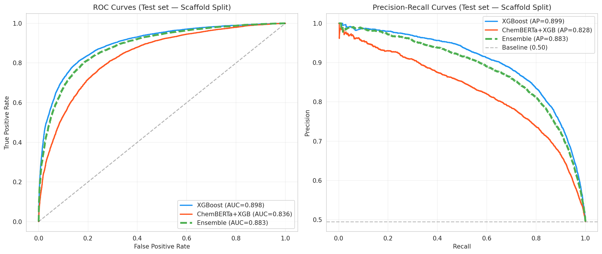
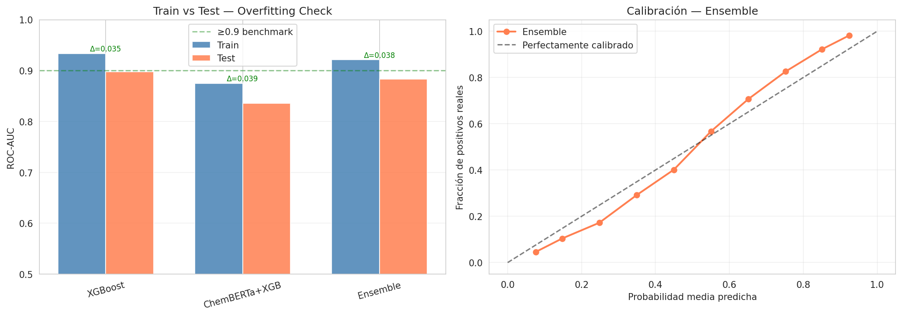
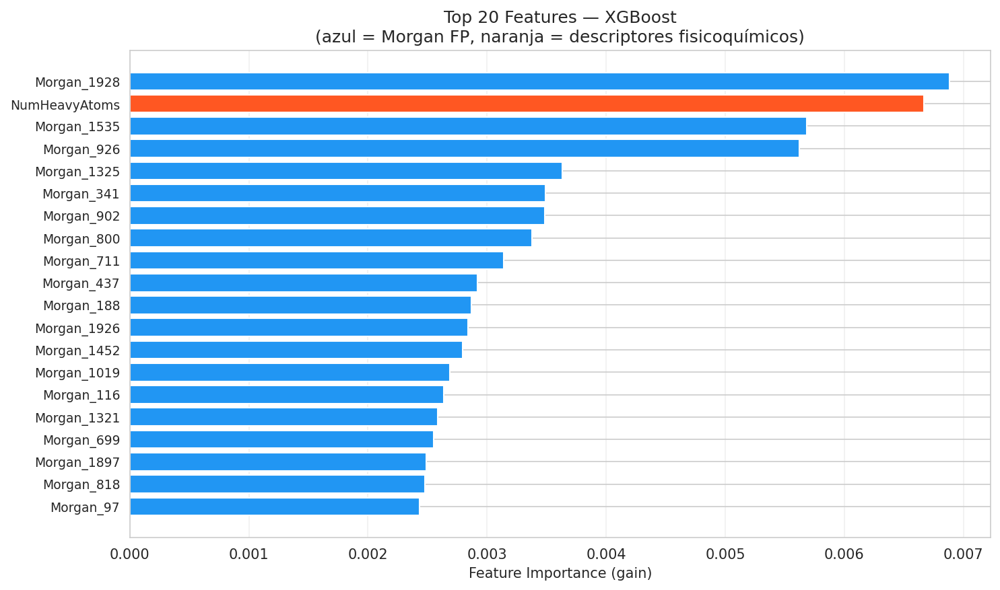
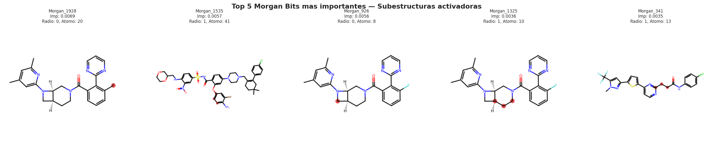
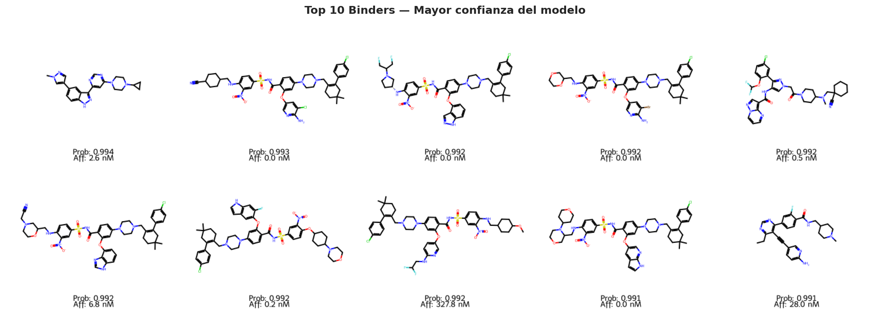
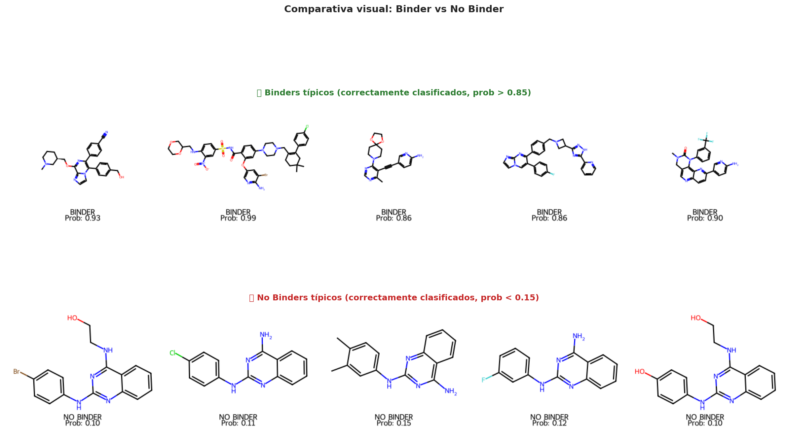
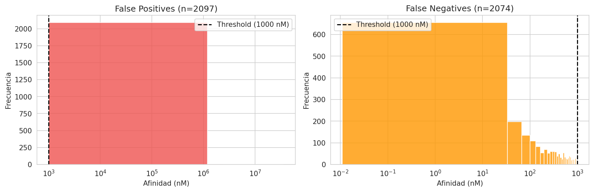
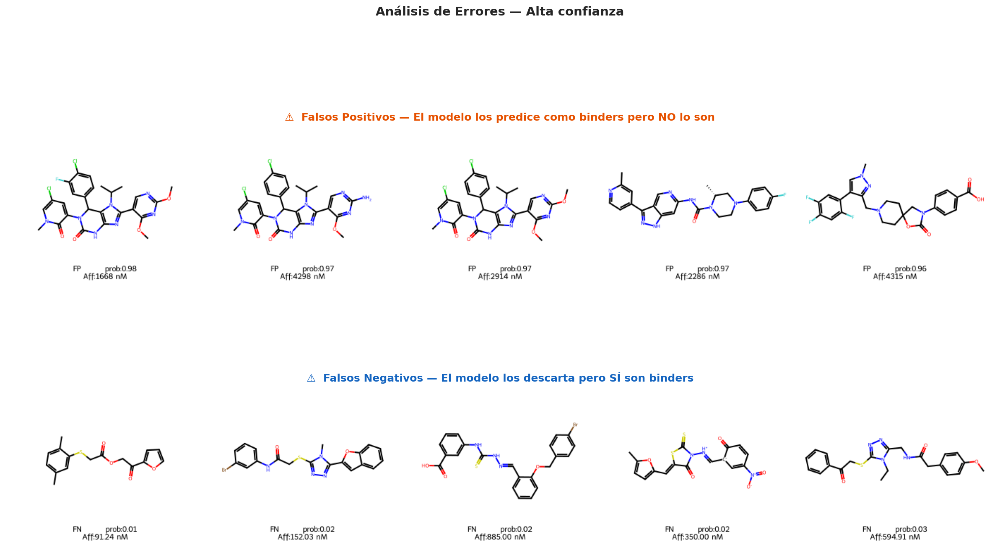
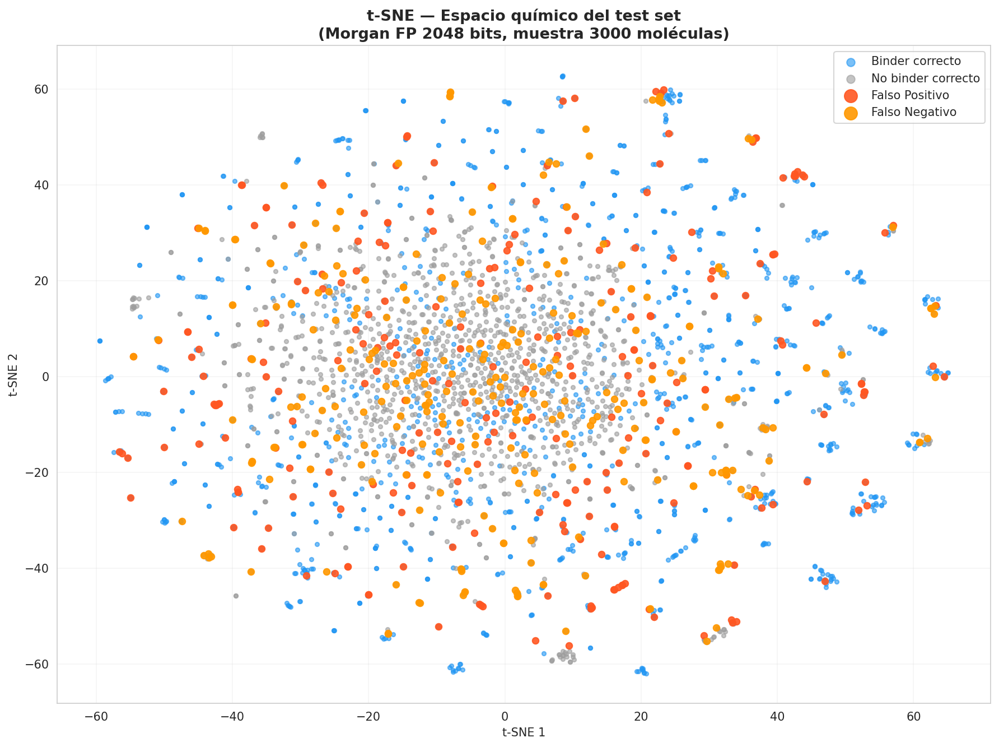

# Drug-Protein Interaction ML

Idioma: Español | [English](README.md)

> Predicción de interacciones fármaco-proteína mediante Machine Learning sobre datos reales de BindingDB.  
> Proyecto personal que combina conocimientos de informática, administración de empresas y bioquímica.


---
---

## Índice

- [Descripción](#descripción)
- [Impacto de Negocio y Eficiencia Operativa](#impacto-de-negocio-y-eficiencia-operativa)
- [Estructura del repositorio](#estructura-del-repositorio)
- [Aplicación interactiva](#aplicación-interactiva)
- [Metodología](#metodología)
- [Resultados](#resultados)
- [Interpretabilidad](#interpretabilidad)
- [Visualizaciones moleculares](#visualizaciones-moleculares)
- [Requisitos](#requisitos)
- [Cómo ejecutar](#cómo-ejecutar)
- [Formato del CSV de entrada](#formato-del-csv-de-entrada-inferencia)
- [Limitaciones](#limitaciones)
- [Autor](#autor)
- [Licencia](#licencia)

---
---

## Descripción

Este proyecto implementa un **pipeline completo de virtual screening** para predecir si una molécula pequeña (candidato a fármaco) tiene probabilidad de unirse a una proteína diana. El modelo permite priorizar compuestos en librerías de miles de moléculas antes de realizar ensayos experimentales costosos, reduciendo significativamente el tiempo y coste del proceso de descubrimiento de fármacos.

**Dataset:** [BindingDB](https://www.bindingdb.org/) — base de datos pública con más de 2.8M de medidas de afinidad entre moléculas y proteínas.

---

## Impacto de Negocio y Eficiencia Operativa

Como estudiante de ADE, este proyecto ha sido diseñado no solo como un reto técnico, sino como una solución de **optimización de activos y reducción de riesgos** en la cadena de valor de I+D farmacéutico.

* **El "Filtro de Embudo":** En el descubrimiento de fármacos, el cribado de alto rendimiento (*High-Throughput Screening*) físico es extremadamente costoso. Este pipeline actúa como un filtro crítico que permite procesar una librería virtual de **100,000 compuestos** para priorizar únicamente los **500 candidatos** con mayor probabilidad de éxito.
* **Ahorro de Costes (OPEX):** Al identificar fallos de forma temprana (*Fail Fast*), se evita la inversión de **millones de euros** en ensayos de laboratorio *in vitro* destinados a fracasar, optimizando el presupuesto de investigación.
* **Reducción del Time-to-Market:** La aceleración del cribado inicial permite que las moléculas prometedoras lleguen antes a fases clínicas, maximizando el valor actual neto (VAN) de la propiedad intelectual.

---

## Estructura del repositorio

```
DrugProtein_ML/
├── Drug_Discovery_Training.ipynb   # Pipeline completo de entrenamiento
├── Drug_Discovery_Inference.ipynb  # Predicción sobre librería nueva
├──app.py                          # Aplicación interactiva de virtual screening
├──requeriments.txt
├──xgboost.pkl                 # Modelo entrenado listo para usar
├── examples/
│   └── mi_libreria.csv             # CSV de ejemplo para probar inferencia
└── images/                         # Gráficos generados durante el entrenamiento
```

---
## Aplicación interactiva

El proyecto incluye una **aplicación web interactiva desarrollada con Streamlit** que permite utilizar el modelo de forma directa sobre nuevas moléculas o librerías químicas completas.

### Demo online

La aplicación está desplegada y puede probarse directamente aquí:

👉 https://molecular-predictive-discovery.streamlit.app/

La aplicación permite:

- Analizar una molécula individual a partir de su SMILES
- Obtener probabilidad de binding y clasificación Binder / Non-Binder
- Visualizar la estructura molecular en 2D y 3D
- Calcular propiedades fisicoquímicas y drug-likeness
- Evaluar el perfil molecular multivariable
- Realizar screening automático de librerías en formato CSV
- Rankear candidatos y analizar los mejores hits de forma interactiva

Esto reproduce el flujo real de **virtual screening computacional previo al cribado experimental**.

### Ejecutar la aplicación
```bash
pip install -r requirements.txt  
streamlit run app.py
```
## Metodología

### Preprocesado de datos
- Carga de 500k filas de BindingDB con medidas de Ki, IC50 y Kd
- Limpieza química con RDKit: desalado, canonicalización de SMILES, sanitización
- Eliminación de duplicados por SMILES canónico
- Etiquetado binario: **binder** si afinidad < 1000 nM (1 µM), **no binder** en caso contrario
- Balanceo 1:1 por undersampling → 109,028 moléculas finales

### Featurización molecular
| Feature | Descripción | Dimensiones |
|---|---|---|
| **Morgan FP (ECFP4)** | Fingerprint circular radio 2, estándar de oro en QSAR | 2048 bits |
| **Descriptores fisicoquímicos** | MolWt, LogP, HBA, HBD, TPSA, RotBonds, Aromáticos, QED, HeavyAtoms, FracCSP3 | 10 |

### Split riguroso — Scaffold Split
El dataset se divide por **scaffold de Murcko**: train y test contienen familias químicas completamente distintas, simulando el escenario real de predicción sobre compuestos nuevos.

**Auditoría del split (4 comprobaciones):**
- Scaffold overlap: **0%** (< 1% aceptable)
- SMILES exactos en común: **0**
- Tanimoto NN >= 0.85: **0%** (< 5% aceptable)
- Drift de clases train/test: **0.6%** (< 5% aceptable)

### Modelos entrenados

#### 1. XGBoost + Morgan FP + Descriptores — Mejor modelo
Estándar de la industria pharma para QSAR (Bender et al., 2022). Gradient boosting sobre features sparse de Morgan FP con regularización L1/L2 y early stopping.

#### 2. ChemBERTa + XGBoost
Embeddings de 768 dimensiones del transformer preentrenado en 77M moléculas (ZINC), usados como input para XGBoost. La arquitectura evita el sobreajuste de una MLP adicional.

#### 3. Ensemble (promedio simple)
Combinación de ambos modelos con pesos fijos iguales. **Los pesos no se optimizan sobre el test set** para evitar data leakage.

---

## Resultados

| Modelo | Train ROC-AUC | Test ROC-AUC | Gap | PR-AUC | F1 | MCC | Brier |
|---|---|---|---|---|---|---|---|
| **XGBoost** | 0.9333 | **0.8979** | 0.0354 | **0.8993** | **0.8199** | **0.6470** | **0.1291** |
| ChemBERTa+XGB | 0.8748 | 0.8357 | 0.0391 | 0.8283 | 0.7627 | 0.5238 | 0.1651 |
| Ensemble | 0.9211 | 0.8832 | 0.0379 | 0.8830 | 0.8071 | 0.6174 | 0.1404 |

> **XGBoost supera al ensemble** porque ChemBERTa fue preentrenado en ZINC, con distribución química diferente a BindingDB, lo que limita la calidad de sus embeddings en este dominio.
>
> Todos los gaps train/test están por debajo de 0.05, confirmando ausencia de sobreajuste significativo.

### Curvas ROC y Precision-Recall



### Diagnóstico de sobreaprendizaje y calibración



### Garantías metodológicas
- Scaffold split con 4 comprobaciones de integridad
- Early stopping en todos los modelos XGBoost
- Ensemble con pesos fijos (sin optimización sobre test)
- Calibración de probabilidades reportada (Brier score)
- Train/test gap reportado para cada modelo
- Interpretabilidad de features (bitInfo + visualización de subestructuras)

---

## Interpretabilidad

### Importancia de features — XGBoost

Los Morgan Fingerprints dominan el modelo con un 98.8% de la importancia total. El único descriptor fisicoquímico en el top 20 es **NumHeavyAtoms**, lo que tiene sentido biológico: las moléculas más grandes tienen más superficie de contacto con la proteína.



### Subestructuras activadoras de los bits más importantes

Con `bitInfo` de RDKit podemos mapear cada bit de Morgan a la subestructura química que lo activa, visualizándola directamente sobre la molécula.



---

## Visualizaciones moleculares

### Top 10 binders con mayor confianza del modelo



### Binder típico vs No binder típico



### Análisis de errores — Falsos Positivos y Falsos Negativos

Los FP tienen afinidades muy débiles (> 10,000 nM) y son estructuralmente similares a inhibidores de kinasas conocidos. Los FN son ultra-potentes (< 1 nM), estructuralmente atípicos y poco representados en el entrenamiento.





### Espacio químico — t-SNE (3000 moléculas del test set)

Proyección 2D de los Morgan FP que muestra cómo se distribuyen binders y errores en el espacio estructural.



---

## Requisitos

| Librería | Versión recomendada |
|---|---|
| Python | >= 3.9 |
| RDKit | >= 2023.x |
| XGBoost | >= 1.7 |
| scikit-learn | >= 1.2 |
| transformers | >= 4.x (solo para ChemBERTa) |
| PyTorch | >= 2.0 (solo para ChemBERTa) |

---

## Cómo ejecutar

### Opción A — Solo inferencia (rápido, sin reentrenar)
El modelo ya está entrenado en `xgboost.pkl`. Solo necesitas tu librería de compuestos.

1. Prepara un CSV con una columna `smiles` (y opcionalmente `label` con 0/1)
2. Abre `Drug_Discovery_Inference.ipynb`
3. Edita la celda de configuración con la ruta a tu CSV
4. Ejecuta todas las celdas

**Output:** probabilidad de binding, clasificación BINDER/NO BINDER, visualizaciones moleculares y reporte.

### Opción B — Entrenamiento completo (requiere BindingDB)
1. Descarga `BindingDB_All.tsv` desde [bindingdb.org](https://www.bindingdb.org/bind/chemsearch/marvin/Download.jsp) (~6 GB)
2. Colócalo en la raíz del proyecto junto al notebook
3. Abre `Drug_Discovery_Training.ipynb`
4. Ejecuta todas las celdas (~45 min con GPU, ~90 min sin GPU)

> **Recomendado:** ejecutar en [Google Colab](https://colab.research.google.com/) con GPU activada para reducir el tiempo de entrenamiento de ChemBERTa.

---

## Formato del CSV de entrada (inferencia)

```csv
smiles,name,label
CC(=O)Oc1ccccc1C(=O)O,Aspirina,0
Cc1ccc(NC(=O)c2ccc(CN3CCN(C)CC3)cc2)cc1Nc1nccc(-c2cccnc2)n1,Imatinib,1
```

| Columna | Obligatoria | Descripción |
|---|---|---|
| `smiles` | Si | SMILES de la molécula |
| `name` | No | Nombre del compuesto |
| `label` | No | Etiqueta real (0/1) — activa métricas de rendimiento |

---

## Limitaciones

- El modelo predice binding **en general**, no frente a una proteína diana específica. Es útil como filtro estructural previo al screening experimental.
- Entrenado con el sesgo de publicación de BindingDB (overrepresentación de activos y de ciertos targets como kinasas).
- El Enrichment Factor está limitado por el balanceo 1:1 del dataset de entrenamiento.

---

## Autor

Proyecto personal desarrollado como demostración de la intersección entre informática, administración de empresas y bioquímica computacional.

- **Stack:** Python, RDKit, XGBoost, HuggingFace Transformers, scikit-learn
- **Datos:** BindingDB (dominio público)
- **Entorno:** Google Colab / Jupyter Notebook

---

## Licencia


MIT License — libre para uso académico y personal.

---

***María Campos Carneros, 2026***


